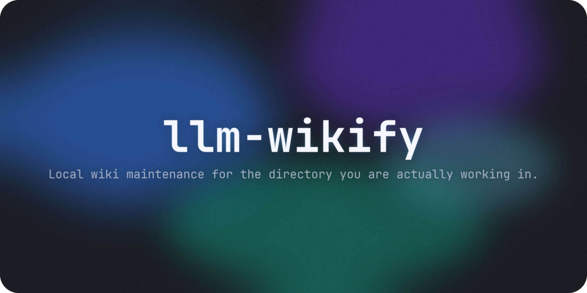

<p align="center"></p>

<h1 align="center">llm-wikify</h1>
<p align="center">
  <em>Turn the current working directory into a small, compounding LLM wiki — without building a giant universal vault.</em>
</p>
<p align="center">
  <a href="#when-to-use">When to Use</a> · <a href="#quick-start">Quick Start</a> · <a href="#features">Features</a> · <a href="#workflow">Workflow</a> · <a href="#repo-layout">Repo Layout</a> · <a href="./README-ko.md">한국어</a>
</p>
<p align="center">
  
  
  
  
</p>

---

> [!NOTE]
> `llm-wikify` is inspired by Karpathy’s `llm-wiki` pattern, but optimized for **task-driven work**. Instead of forcing the model to constantly reason over one ever-growing mega-wiki, this skill treats the **current working directory as a mini wiki boundary**. New sources dropped into `raw/` get integrated into a small, local markdown knowledge base that stays useful for the project at hand.

## Why this exists

Karpathy’s core idea is excellent: let the LLM maintain a persistent wiki instead of rediscovering knowledge from raw documents on every question.

The practical problem is scope. In day-to-day engineering, research, due diligence, and project work, a single giant knowledge base becomes expensive to maintain and noisy to query. `llm-wikify` narrows the unit of maintenance to the **active repo or task folder**.

That gives you a better default:

- smaller wiki surface area
- faster navigation for humans and agents
- easier provenance and maintenance
- cleaner ingestion of new materials into the current project
- less temptation to over-abstract everything into a personal PKM empire

## Features

- **Task-local wiki boundary** — the working directory is the wiki unless the user explicitly asks for something broader
- **Bootstrap mode** — creates a small, MECE wiki structure when no wiki exists yet
- **Ingest mode** — reads new materials from `raw/` and integrates them into source pages, topic pages, and indexes
- **Maintenance mode** — audits stale pages, broken links, orphans, duplicates, and weak navigation
- **Provenance-first workflow** — preserves where claims came from instead of turning source material into unsupported summary sludge
- **Minimal structure bias** — creates only the folders and pages justified by the current project
- **Grounding requirement** — durable pages should say what repo landmarks, source notes, or raw inputs they were built from
- **Idempotent ingest bias** — the same source should update stable notes and pages, not create duplicate wiki clutter
- **Compound knowledge** — useful query answers can be filed back into the wiki instead of vanishing into chat history

## When to Use

Use `llm-wikify` when you want to:

- turn a repo or task directory into a persistent markdown knowledge base
- ingest new source files, notes, URLs, exports, or transcripts into `raw/`
- keep project understanding stable across sessions
- maintain a small wiki for research, engineering, due diligence, planning, or documentation work
- health-check and clean up an existing local wiki

Do **not** use it when you only need:

- a one-shot summary
- generic markdown cleanup
- a full personal-vault redesign
- a global PKM taxonomy spanning many unrelated projects

## Quick Start

### 1. Quick Skill Installation for LLM

> [!TIP]
> If your LLM agent can run shell commands, you can copy the block below, paste it into the chat, and let the agent install the skill automatically.

```text
Install the llm-wikify skill for me.
1. git clone https://github.com/wjgoarxiv/llm-wikify /tmp/llm-wikify
2. mkdir -p ~/.claude/skills/llm-wikify
3. cp -r /tmp/llm-wikify/SKILL.md /tmp/llm-wikify/assets /tmp/llm-wikify/evals ~/.claude/skills/llm-wikify/
4. cp /tmp/llm-wikify/generate_cover.sh ~/.claude/skills/llm-wikify/
5. chmod +x ~/.claude/skills/llm-wikify/generate_cover.sh
6. Test: test -f ~/.claude/skills/llm-wikify/SKILL.md && echo "OK: llm-wikify installed"
7. Say "llm-wikify installed successfully"
```

For other tools, change the target skills path:

- Codex CLI: `~/.codex/skills/llm-wikify/`
- OpenCode: `~/.config/opencode/skills/llm-wikify/`
- Gemini CLI: `~/.gemini/skills/llm-wikify/`

### 2. Put source material in `raw/`

Examples:

- clipped articles
- PDFs converted to markdown
- meeting notes
- interview transcripts
- copied docs
- URLs the agent should ingest

### 3. Ask your agent to wikify the current directory

Example prompts:

```text
Turn this working directory into a small local wiki.
Bootstrap only the minimum structure we need.
```

```text
Ingest the files in raw/ into this project wiki.
Preserve provenance and avoid one giant dump page.
```

```text
Lint and maintain the wiki in this directory.
Fix safe issues and leave a short maintenance report.
```

### 4. Let the wiki compound

Over time, the agent should update:

- `wiki/home.md`
- `wiki/index.md`
- topic pages
- source notes
- maintenance logs

The raw material stays raw. The wiki becomes the maintained synthesis layer.

## Workflow

### Bootstrap

If the wiki does not exist, `llm-wikify` should:

1. inspect the current directory first
2. preserve existing docs instead of duplicating them
3. create a minimal folder structure
4. seed `home.md`, `index.md`, and a few grounded pages
5. define local rules in `schema/wiki-rules.md`

### Ingest

When new material appears in `raw/`, the skill should:

1. read the source
2. create or update a source note
3. update related topic/entity pages
4. mark uncertainty where evidence is weak or partial
5. record the ingest in `log/log.md`

### Query

When the user asks a project question, the agent should:

1. read `wiki/index.md`
2. follow relevant local pages
3. answer using the maintained wiki
4. file durable analyses back into the wiki when they are worth keeping

### Lint / maintain

The skill should periodically check for:

- stale pages
- broken links
- orphan pages
- duplicate topics
- inconsistent naming
- weak summaries
- raw-ingestion leftovers

Then it should make safe fixes and leave a maintenance report.

It should not pass maintenance by producing neat-looking indexes and reports without real cleanup.

## Repo Layout

```text
llm-wikify/
├── SKILL.md
├── README.md
├── cover.png
├── generate_cover.sh
├── assets/
│   ├── home-template.md
│   ├── maintenance-report-template.md
│   ├── source-note-template.md
│   └── wiki-rules-template.md
└── evals/
    └── evals.json
```

## Default Folder Contract for Wikified Projects

The skill’s default target shape is intentionally small:

```text
raw/
wiki/
  home.md
  index.md
  topics/
  entities/
  sources/
schema/
  wiki-rules.md
log/
  log.md
```

This is a **starter contract**, not a prison. If the project clearly needs less, use less.

## Design Principles

### 1. Local first
The project directory is the knowledge boundary.

### 2. Incremental over regenerative
Update related pages when new sources arrive. Do not rebuild everything by default.

### 3. Provenance over vibes
Important claims should point back to source notes or raw material.

### 4. Navigation over volume
Make pages easier to enter and follow. More pages are not automatically better.

### 5. Maintenance is the product
The wiki is only useful if the agent keeps it coherent as new material arrives.

## Inspiration

This skill is directly inspired by Karpathy’s `llm-wiki` idea: a persistent wiki maintained by the model instead of repeated chunk retrieval from raw sources.

`llm-wikify` narrows that pattern to a more practical default for everyday work: **one task directory, one maintained mini wiki**.

## Validation

The repo includes baseline pressure prompts in `evals/evals.json` covering three failure-prone modes:

- bootstrap a local wiki from a messy repo
- ingest mixed materials from `raw/`
- maintain an evolving wiki without flattening it into one file

Those prompts are meant to catch the common baseline failure: a generic agent says sensible things, but lacks a disciplined local-wiki operating contract.
